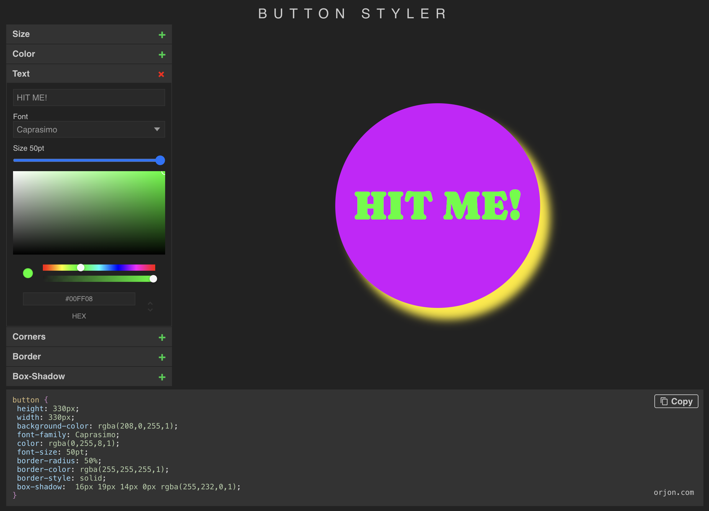
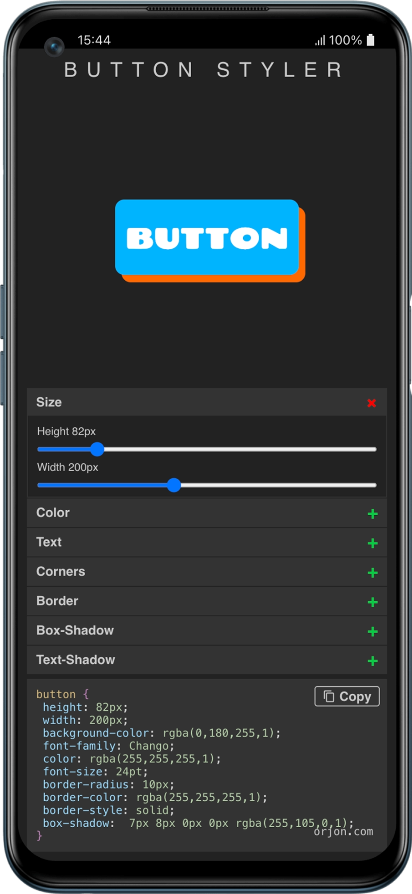

# Button Styler
### Visual CSS button designer

Button Styler is a browser-based tool for designing CSS button styles in real time. Adjust size, colour, typography, borders, corners, box-shadow, and text-shadow through a panel of controls and see the result instantly. The generated CSS is displayed in a code block and can be copied to the clipboard with a single click.

<table>
  <tr>
    <td width="74%"></td>
    <td width="26%"></td>
  </tr>
</table>

---

## Technologies

| | |
|---|---|
| **Framework** | React 17 |
| **State** | Redux |
| **Styling** | SCSS (Dart Sass) |
| **Toolchain** | Create React App (react-scripts 5) |

---

## Getting Started

Install dependencies and start the development server:

```bash
pnpm install
pnpm start
```

Open [http://localhost:3000](http://localhost:3000) in your browser.

---

## Commands

```bash
pnpm start    # Start development server
pnpm build    # Production build (output to /build)
pnpm test     # Run tests
```

---

## Live

[orjon.com/buttonstyler](https://www.orjon.com/buttonstyler)
